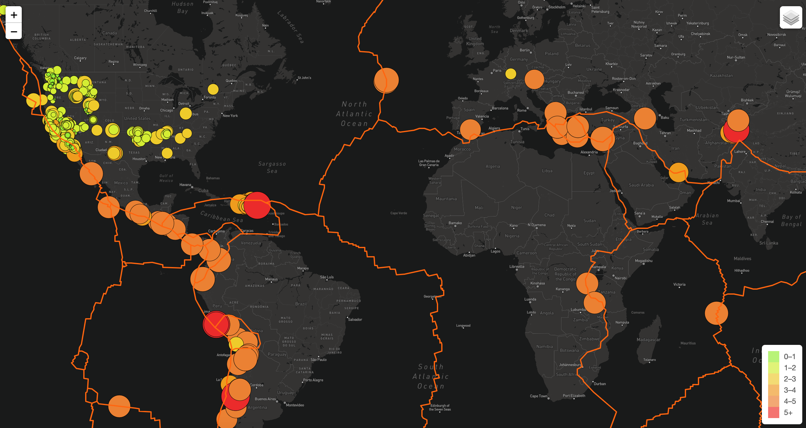
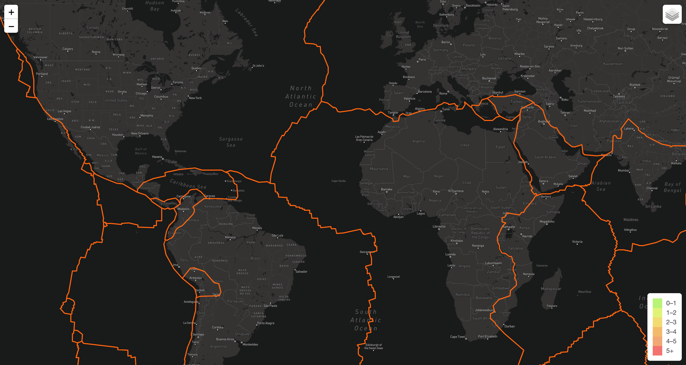
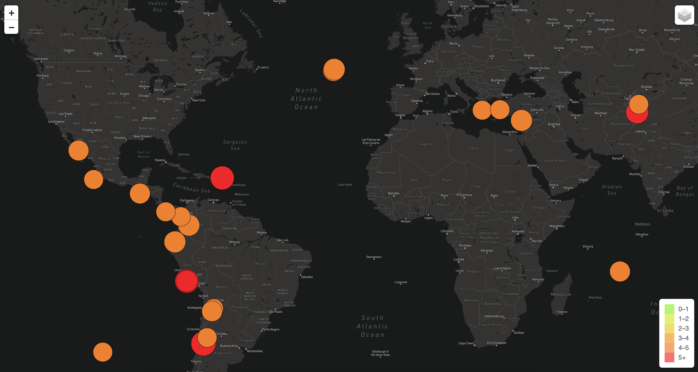

# Mapping_Earthquakes

## Overview
We were instructed to analyze Earthquakes and the tectonic plates on Earth. We were able to add layers to the map as well as a legend and a control so that we can click through layers and map controls.

## Results
According to our data, we can confirm that a large majority of earthquakes happen along the tectonic plates. What's more, we can determine that Major Earthquakes almost always happen along the tectonic plate/fault lines.

## Summary

We are able to determine where earthquakes are more likely to occur. This is important because keeping track of earthquakes could benefit the safety of people living in these areas.
